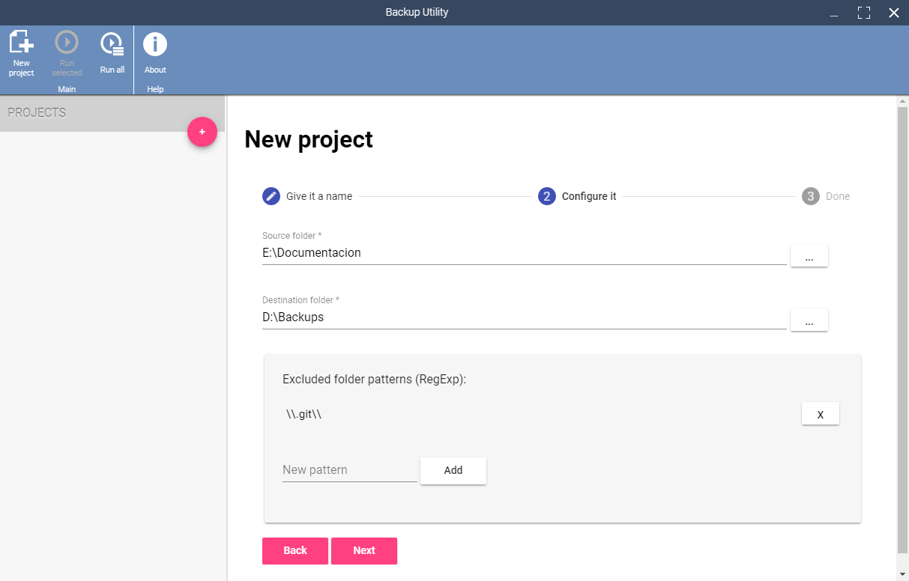
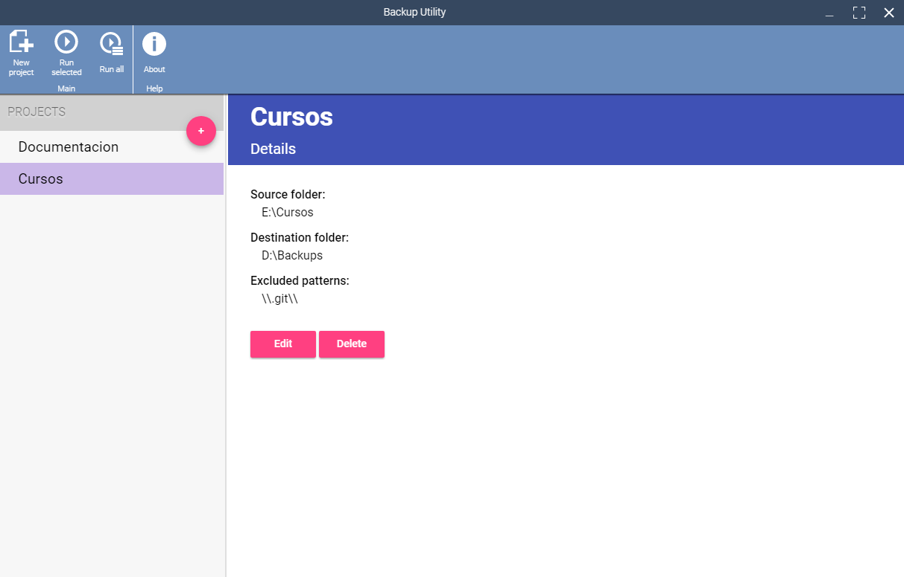

# Backup
Backup Utility Application *(Beta)*

With this utility you can make directory backups easily and intuitively.

## Running

Open a terminal inside a folder where you want to clone the sources.

    > git clone https://github.com/smillase/backup.git
    > cd backup
    > npm install
    > npm install -g electron-forge
    > electron-forge start

*WARNING:* This software is in Beta phase and may have failures. It also lacks many features, so do not use on important files.
